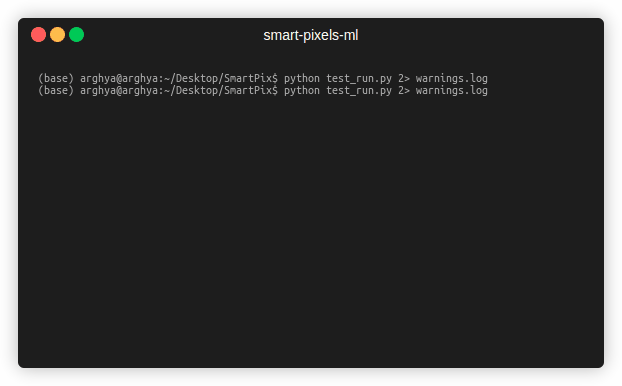

# Smart Pixels (ML)

<p align="left">
  <a href="https://iopscience.iop.org/article/10.1088/2632-2153/ad6a00"></a>
  <a href="https://arxiv.org/abs/2312.11676"></a>
  <a href="https://github.com/smart-pix/smart-pixels-ml"></a>
  <a href="https://github.com/smart-pix/smart-pixels-ml"></a>
</p>


Smart Pixels is a project focused on implementing machine learning models directly on silicon pixels or future detectors to enhance the inference of charged particle track parameters. We here use an MDN (Mixture Density Network) with one Gaussian. This model predicts the mean value of the target variable and the associated uncertainty to that prediction, with NLL (Negative Log-likelihood Loss) as the loss function to minimize. 

## Table of Contents
- [Getting Started](#getting-started)
  - [Installation](#installation)
  - [Usage](#usage)
- [Dataset](#dataset)
  - [Structure](#structure)
  - [Data Visualization](#data-visualization)
- [Data Generator](#data-generator)
- [Testing](#testing)
- [Model Architecture](#model-architecture)
- [Model Evaluation](#model-evaluation)

## Getting Started

### Installation
1. Clone the repository:
```bash
git clone https://github.com/smart-pix/smart-pixels-ml.git
cd smart-pixels-ml
pip install -r requirements.txt
```
Testing successful installation by running 
```bash
python test_run.py`
```
The test run should perform a basic smoke test to check if the installation is successful and basic things that we need are working fine. Details can be found in [Testing](testing.md)
 > The output should look like this:



### Usage

For the usage guide refer to [Usage Guide](usage.md)


## Dataset

Download the simulated data from: [zenodo](https://doi.org/10.5281/zenodo.7331128)
and [PixelAV](https://docs.google.com/document/d/1ZoqVyJOOAXhzt2egMWh3OoNJ6lWq5lNR6sjcYON4Vlo/edit?tab=t.0#heading=h.k6tyal7z5t5l)

### Structure
- **Input Data (dataX)**: Consists of 2D images representing the charge deposited by a particle, with each channel showing a different time slice of the particle’s passage. You can choose to work with either `2` time slices (reduced) or the full `20` time slices. These correspond to input shapes of `(13, 21, 2)` and `(13, 21, 20)` respectively.
  
- **Labels (dataY)**: _Four_ target variables are chosen as the labls viz. local $x$, local $y$, $\alpha$ angle and $\beta$ angle, associated with the particle trajectory.

### Data Visualization
For visualization of the how the input data looks like, we have to define the path towards the `dataX` and optionally to the _labels_ as 
```python
import pandas as pd
import matplotlib.pyplot as plt

dataX = pd.read_parquet("path/to/recon3D_data_file")
labels_df = pd.read_parquet("path/to/labels_data_file")
reshaped_dataX = dataX.values.reshape((len(dataX), 20, 13, 21))

print(labels_df.iloc[0])
plt.imshow(reshaped_dataX[0, 0, :, :], cmap='coolwarm')  # first time-step
plt.show()
plt.imshow(reshaped_dataX[0, -1, :, :], cmap='coolwarm')  # last time-step
plt.show()

```

## Data Generator
Due to the large size of the dataset, the entire dataset can not be loaded into RAM. Hence, we use data generators to load the dataset on the fly during training with inbuilt quantization, standardization, shuffling, etc. 
Refer to [data generator](api/data_generator.md) for more details.

## Testing 
To test that everything is working fine try running the simple `test_run.py` file as
```bash
python test_run.py
```


## Model Architecture
The core model architecture is defined in [model.py](../models.py), which provides the baseline MDN architecture with quantized neural network layers. We use the Negative Log-Likelihood (NLL) as the loss function implemented in [loss.py](../loss.py). A good reading about it can be found [here](https://towardsdatascience.com/mixture-density-networks-probabilistic-regression-for-uncertainty-estimation-5f7250207431)

Refer to [Model](api/models.md) and [Loss](api/loss.md) for more details.


As an example, to implement the model with 2 time slices:
```python
from model import *

model=CreateModel((13,21,2),n_filters=5,pool_size=3)
model.summary()
```
This generates a model with the following architecture:

<table>
  <thead>
    <tr>
      <th>Type</th>
      <th>Output Shape</th>
      <th>Parameters</th>
    </tr>
  </thead>
  <tbody>
    <tr>
      <td>InputLayer</td>
      <td>(None, 13, 21, 2)</td>
      <td>0</td>
    </tr>
    <tr>
      <td>QSeparableConv2D</td>
      <td>(None, 11, 19, 5)</td>
      <td>33</td>
    </tr>
    <tr>
      <td>QActivation</td>
      <td>(None, 11, 19, 5)</td>
      <td>0</td>
    </tr>
    <tr>
      <td>QConv2D</td>
      <td>(None, 11, 19, 5)</td>
      <td>30</td>
    </tr>
    <tr>
      <td>QActivation</td>
      <td>(None, 11, 19, 5)</td>
      <td>0</td>
    </tr>
    <tr>
      <td>AveragePooling2D</td>
      <td>(None, 3, 6, 5)</td>
      <td>0</td>
    </tr>
    <tr>
      <td>QActivation</td>
      <td>(None, 3, 6, 5)</td>
      <td>0</td>
    </tr>
    <tr>
      <td>Flatten</td>
      <td>(None, 90)</td>
      <td>0</td>
    </tr>
    <tr>
      <td>QDense</td>
      <td>(None, 16)</td>
      <td>1456</td>
    </tr>
    <tr>
      <td>QActivation</td>
      <td>(None, 16)</td>
      <td>0</td>
    </tr>
    <tr>
      <td>QDense</td>
      <td>(None, 16)</td>
      <td>272</td>
    </tr>
    <tr>
      <td>QActivation</td>
      <td>(None, 16)</td>
      <td>0</td>
    </tr>
    <tr>
      <td>QDense</td>
      <td>(None, 14)</td>
      <td>238</td>
    </tr>
  </tbody>
</table>

## Model Evaluation
Refer to [Evaluate](api/evaluate.md) for more details
